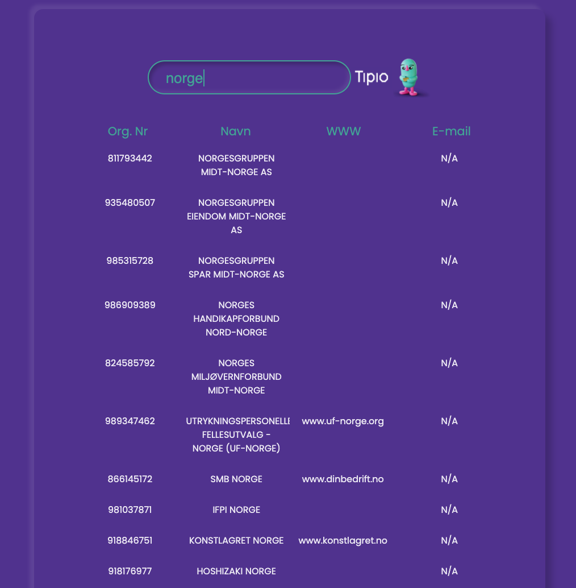
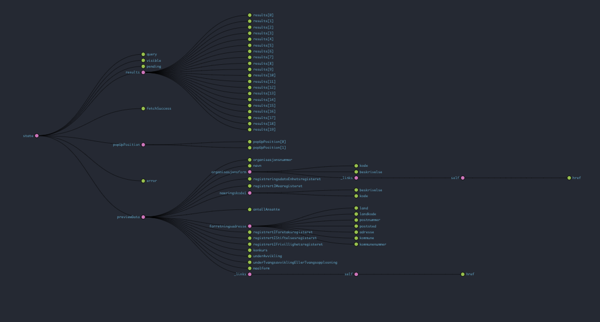

# Søk mot Brønnøysundregisteret

[Try live version](https://mlvrkhn.github.io/bluebird-api/)

### Installation

Download packages.
```
npm i
```

Start app  
```
npm start
```

### Project features:
- search Brønnøysundregisteret based on organisasjonsnummer,
- also search based on user input with companys name,
- starts searching when third letter is provided,
- present the info in clear and nice way,
- results should be continuously presented under the search field,
- display info on click,
- bankrupt companies are displayed with bold,
- click on companys website takes you there,
- autocompose email to company on Click.
### Project problems:
- build with React.js and Redux,
- Webpack and Babel configuration,
- upload and use external fonts via file-loader,
- type checking with PropTypes,
- dynamic API search,
- separate API and separate BrregModule,
- error handling,
- matching neumophic design, external fonts,
- separate Redux store and state management with Thunk middleware and React Hooks,
- used Hooks: useState, useEffect, useDispatch, useSelector,
- introduced global app theme, Global Styling,
- appearance created with Styled-Components
### App preview
  

### Redux Store Structure
